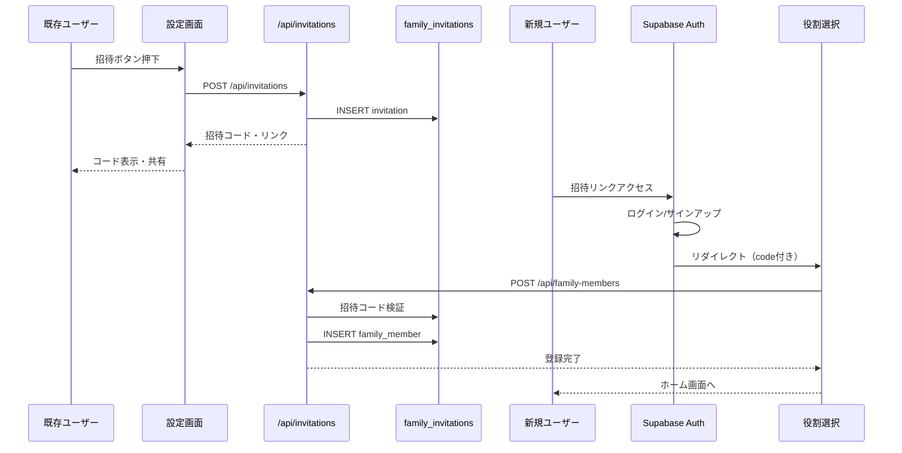
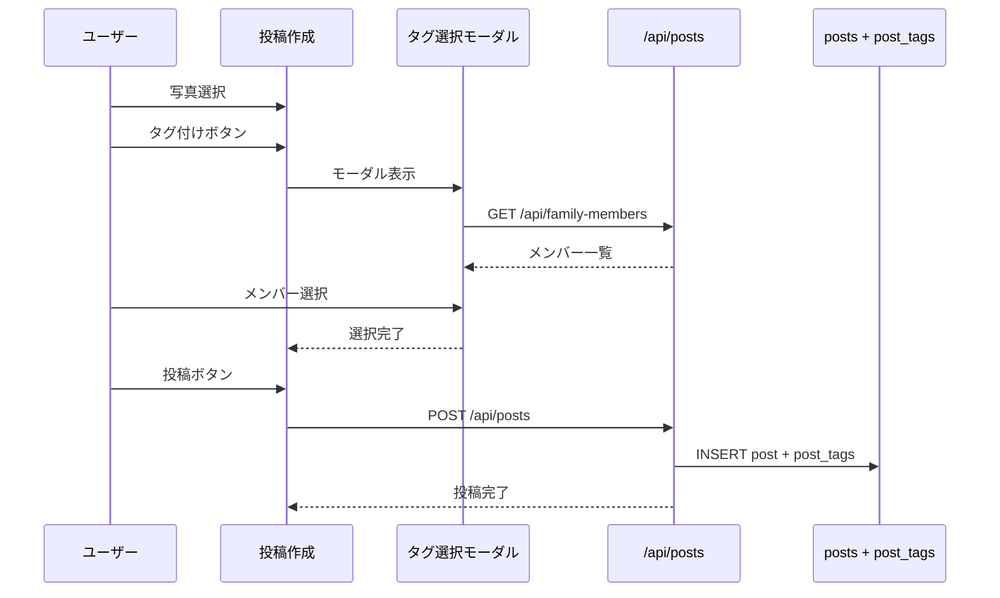
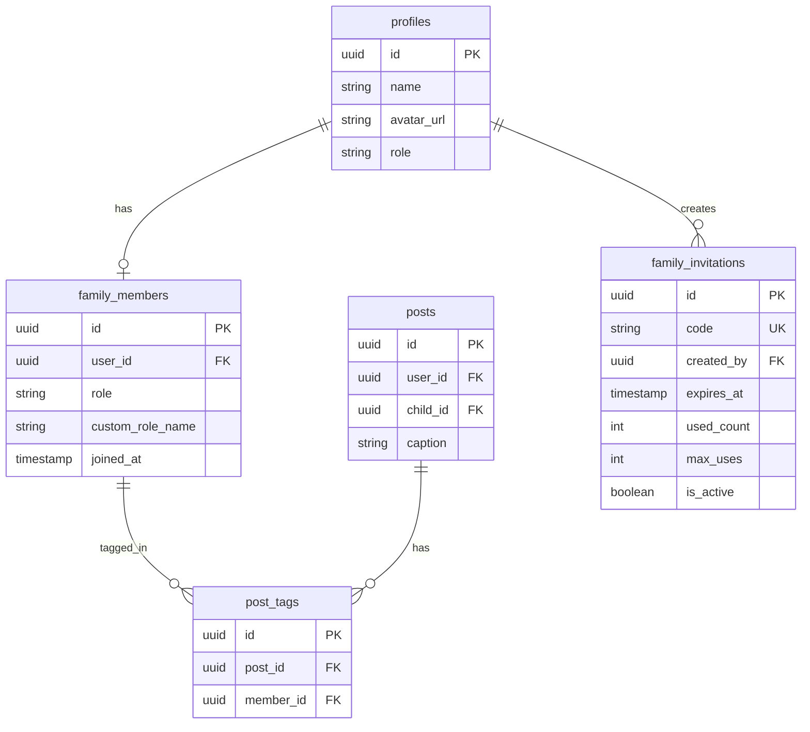

# Design Document

## Overview

**Purpose**: 家族SNSアプリ「Sprout」に家族アカウント管理機能を追加し、家族メンバーの招待・役割管理・写真タグ付け・フィルタリングを実現する。

**Users**: 既存ユーザー（中野家）および招待された新規家族メンバーが、写真共有と家族管理に利用する。

**Impact**: 既存のprofiles/postsシステムを拡張し、family_members・family_invitations・post_tagsテーブルを追加。認証フローに役割選択ステップを組み込む。

### Goals
- 招待制での家族メンバー追加（8文字コード、7日有効期限）
- 9種類の家族役割による明確な関係性表示
- 写真への家族メンバータグ付けと効率的なフィルタリング
- 既存ユーザーのシームレスな移行

### Non-Goals
- マルチテナント（複数家族）対応（将来検討）
- 家族メンバーの削除・退会機能（将来検討）
- 招待コードの再発行機能（今回スコープ外）

## Architecture

### Existing Architecture Analysis

現システムは以下の構成:
- **認証**: Supabase Auth（Google OAuth / Email OTP）
- **データ**: Supabase PostgreSQL + RLS
- **フロント**: Next.js 16 App Router + React 19
- **ストレージ**: AWS S3（presigned URL経由）

既存パターンを継承しつつ、以下を追加:
- 招待管理（family_invitations）
- 家族メンバー管理（family_members）
- 写真タグ（post_tags）

### Architecture Pattern & Boundary Map

```mermaid
graph TB
    subgraph Frontend
        Settings[設定画面]
        Onboarding[オンボーディング]
        Timeline[タイムライン]
        Upload[投稿作成]
    end

    subgraph API
        InvitationAPI[/api/invitations]
        MemberAPI[/api/family-members]
        TagAPI[/api/posts/tags]
    end

    subgraph Database
        Invitations[family_invitations]
        Members[family_members]
        Tags[post_tags]
        Profiles[profiles]
        Posts[posts]
    end

    Settings --> InvitationAPI
    Settings --> MemberAPI
    Onboarding --> MemberAPI
    Timeline --> TagAPI
    Upload --> TagAPI

    InvitationAPI --> Invitations
    MemberAPI --> Members
    MemberAPI --> Profiles
    TagAPI --> Tags
    TagAPI --> Posts
    TagAPI --> Members
```

**Architecture Integration**:
- **Selected pattern**: 既存アーキテクチャ拡張（モノリシック、APIルートベース）
- **Domain boundaries**: 招待管理・メンバー管理・タグ管理を独立APIとして分離
- **Existing patterns preserved**: RLS、AuthProvider、Toast通知、モーダルUI
- **New components rationale**: 既存の設定画面パターンを踏襲しつつ、オンボーディングのみ独立ページ

### Technology Stack

| Layer | Choice / Version | Role in Feature | Notes |
|-------|------------------|-----------------|-------|
| Frontend | Next.js 16 / React 19 | UI・ルーティング | 既存継続 |
| Backend | Next.js API Routes | REST API | 既存パターン継続 |
| Data | Supabase PostgreSQL | 永続化・RLS | 3テーブル追加 |
| Auth | Supabase Auth | 認証・セッション | 招待フロー統合 |

## System Flows

### 招待フロー



### 写真タグ付けフロー



## Requirements Traceability

| Requirement | Summary | Components | Interfaces | Flows |
|-------------|---------|------------|------------|-------|
| 1.1-1.6 | 家族メンバー招待 | InvitationButton, InvitationModal | POST /api/invitations | 招待フロー |
| 2.1-2.5 | 役割選択 | RoleSelectionPage | POST /api/family-members | 招待フロー |
| 3.1-3.4 | メンバー一覧表示 | FamilyMemberList, RoleEditModal | GET/PUT /api/family-members | - |
| 4.1-4.5 | 写真タグ付け | TagSelector, TagBadges | POST/PUT /api/posts/[id]/tags | タグ付けフロー |
| 5.1-5.5 | タグフィルタリング | MemberFilter | GET /api/posts | - |
| 6.1-6.3 | 既存ユーザー移行 | MigrationBanner | - | マイグレーション |

## Components and Interfaces

| Component | Domain/Layer | Intent | Req Coverage | Key Dependencies | Contracts |
|-----------|--------------|--------|--------------|------------------|-----------|
| InvitationButton | UI/Settings | 招待コード生成トリガー | 1.1 | InvitationModal (P0) | - |
| InvitationModal | UI/Settings | 招待コード表示・共有 | 1.1-1.6 | InvitationAPI (P0) | API |
| RoleSelectionPage | UI/Onboarding | 役割選択オンボーディング | 2.1-2.5 | FamilyMemberAPI (P0) | API |
| FamilyMemberList | UI/Settings | メンバー一覧・編集 | 3.1-3.4 | FamilyMemberAPI (P0) | API |
| TagSelector | UI/Upload | タグ付けメンバー選択 | 4.1-4.3 | FamilyMemberAPI (P0) | API |
| TagBadges | UI/Timeline | タグ付けメンバー表示 | 4.4 | - | - |
| MemberFilter | UI/Timeline | メンバーフィルタリング | 5.1-5.5 | PostsAPI (P0) | API |
| InvitationService | API | 招待コード生成・検証 | 1.1-1.6 | Supabase (P0) | Service, API |
| FamilyMemberService | API | メンバー登録・更新 | 2.1-2.5, 3.1-3.4 | Supabase (P0) | Service, API |
| PostTagService | API | タグ管理・フィルタリング | 4.1-4.5, 5.1-5.5 | Supabase (P0) | Service, API |

### API Layer

#### InvitationService

| Field | Detail |
|-------|--------|
| Intent | 招待コードの生成・検証・無効化を管理 |
| Requirements | 1.1, 1.2, 1.3, 1.4, 1.5, 1.6 |

**Responsibilities & Constraints**
- 8文字英数字コードの生成（紛らわしい文字除外: 0,O,I,1,L）
- 有効期限（7日）と使用回数の管理
- 無効コードの適切なエラーレスポンス

**Dependencies**
- Outbound: Supabase — データ永続化 (P0)

**Contracts**: Service [x] / API [x] / Event [ ] / Batch [ ] / State [ ]

##### Service Interface
```typescript
interface InvitationService {
  generateCode(): string;
  createInvitation(userId: string): Promise<Result<Invitation, InvitationError>>;
  validateInvitation(code: string): Promise<Result<Invitation, InvitationError>>;
  markAsUsed(code: string): Promise<Result<void, InvitationError>>;
}

type Invitation = {
  id: string;
  code: string;
  createdBy: string;
  expiresAt: Date;
  usedCount: number;
  maxUses: number;
  isActive: boolean;
};

type InvitationError =
  | { type: 'EXPIRED'; message: string }
  | { type: 'MAX_USES_REACHED'; message: string }
  | { type: 'NOT_FOUND'; message: string }
  | { type: 'ALREADY_MEMBER'; message: string };
```

##### API Contract

| Method | Endpoint | Request | Response | Errors |
|--------|----------|---------|----------|--------|
| POST | /api/invitations | - | `{ code, link, expiresAt }` | 401, 500 |
| GET | /api/invitations/[code] | - | `{ valid, invitation? }` | 404, 410 |

#### FamilyMemberService

| Field | Detail |
|-------|--------|
| Intent | 家族メンバーの登録・役割管理 |
| Requirements | 2.1, 2.2, 2.3, 2.4, 2.5, 3.1, 3.2, 3.3, 3.4 |

**Responsibilities & Constraints**
- 招待経由での新規メンバー登録
- 9種類の定義済み役割 + 「その他」（自由入力）
- 自分の役割のみ編集可能

**Dependencies**
- Outbound: Supabase — データ永続化 (P0)
- Outbound: InvitationService — コード検証 (P0)

**Contracts**: Service [x] / API [x] / Event [ ] / Batch [ ] / State [ ]

##### Service Interface
```typescript
interface FamilyMemberService {
  registerMember(
    userId: string,
    role: FamilyRole,
    invitationCode?: string
  ): Promise<Result<FamilyMember, MemberError>>;

  updateRole(
    userId: string,
    role: FamilyRole
  ): Promise<Result<FamilyMember, MemberError>>;

  listMembers(): Promise<Result<FamilyMember[], MemberError>>;

  getMember(userId: string): Promise<Result<FamilyMember | null, MemberError>>;
}

type FamilyRole =
  | 'mother'
  | 'father'
  | 'grandmother_paternal'
  | 'grandmother_maternal'
  | 'grandfather_paternal'
  | 'grandfather_maternal'
  | 'uncle_aunt'
  | 'other';

type FamilyMember = {
  id: string;
  userId: string;
  role: FamilyRole;
  customRoleName: string | null;
  joinedAt: Date;
  profile: {
    name: string;
    avatarUrl: string | null;
  };
};

type MemberError =
  | { type: 'ALREADY_MEMBER'; message: string }
  | { type: 'INVALID_INVITATION'; message: string }
  | { type: 'NOT_FOUND'; message: string };
```

##### API Contract

| Method | Endpoint | Request | Response | Errors |
|--------|----------|---------|----------|--------|
| GET | /api/family-members | - | `FamilyMember[]` | 401, 500 |
| POST | /api/family-members | `{ role, customRoleName?, invitationCode? }` | `FamilyMember` | 400, 401, 409 |
| PUT | /api/family-members/me | `{ role, customRoleName? }` | `FamilyMember` | 400, 401, 404 |

#### PostTagService

| Field | Detail |
|-------|--------|
| Intent | 投稿への家族メンバータグ付けとフィルタリング |
| Requirements | 4.1, 4.2, 4.3, 4.4, 4.5, 5.1, 5.2, 5.3, 5.4, 5.5 |

**Responsibilities & Constraints**
- 投稿作成時・編集時のタグ設定
- 複数メンバーのタグ付け
- タグによる投稿フィルタリング（子供フィルターと併用可能）

**Dependencies**
- Outbound: Supabase — データ永続化 (P0)

**Contracts**: Service [x] / API [x] / Event [ ] / Batch [ ] / State [ ]

##### Service Interface
```typescript
interface PostTagService {
  setTags(
    postId: string,
    memberIds: string[]
  ): Promise<Result<void, TagError>>;

  getTags(postId: string): Promise<Result<FamilyMember[], TagError>>;

  filterPostsByMembers(
    memberIds: string[],
    childId?: string,
    cursor?: string
  ): Promise<Result<Post[], TagError>>;
}

type TagError =
  | { type: 'POST_NOT_FOUND'; message: string }
  | { type: 'MEMBER_NOT_FOUND'; message: string }
  | { type: 'UNAUTHORIZED'; message: string };
```

##### API Contract

| Method | Endpoint | Request | Response | Errors |
|--------|----------|---------|----------|--------|
| GET | /api/posts/[id]/tags | - | `FamilyMember[]` | 401, 404 |
| PUT | /api/posts/[id]/tags | `{ memberIds: string[] }` | `FamilyMember[]` | 400, 401, 404 |
| GET | /api/posts | `?memberIds=...&childId=...` | `Post[]` | 401, 500 |

### UI Layer

#### RoleSelectionPage

| Field | Detail |
|-------|--------|
| Intent | 招待経由ユーザーの役割選択オンボーディング |
| Requirements | 2.1, 2.2, 2.3, 2.4, 2.5 |

**Contracts**: State [x]

##### State Management
```typescript
type RoleSelectionState = {
  selectedRole: FamilyRole | null;
  customRoleName: string;
  isSubmitting: boolean;
  error: string | null;
};
```

**Implementation Notes**
- ルート: `/onboarding/role`
- 招待コードはURLパラメータから取得
- 役割未選択時は完了ボタン無効化
- 「その他」選択時に自由入力フィールド表示

#### TagSelector

| Field | Detail |
|-------|--------|
| Intent | 投稿作成時の家族メンバー選択UI |
| Requirements | 4.1, 4.2, 4.3 |

**Implementation Notes**
- モーダル形式でメンバー一覧表示
- チェックボックスによる複数選択
- 選択状態をチップ形式で表示

#### MemberFilter

| Field | Detail |
|-------|--------|
| Intent | タイムラインの家族メンバーフィルタリングUI |
| Requirements | 5.1, 5.2, 5.3, 5.4, 5.5 |

**Implementation Notes**
- 既存のChildFilterと同様のUIパターン
- URLパラメータ `memberIds` で状態管理
- フィルター適用中はインジケーター表示
- クリアボタンで全メンバー表示に戻す

## Data Models

### Domain Model



### Logical Data Model

**family_members**
- 1ユーザーにつき1レコード（既存profilesと1:1）
- roleはenum型（9種類 + other）
- custom_role_nameはrole='other'の場合のみ使用

**family_invitations**
- codeは8文字英数字、UNIQUE制約
- expires_atはcreated_at + 7日
- max_uses: 1（将来的に拡張可能）
- is_active: 手動無効化フラグ

**post_tags**
- post_id + member_idでUNIQUE制約
- member_idにインデックス（フィルタリング高速化）

### Physical Data Model

```sql
-- 家族メンバー役割enum
CREATE TYPE family_role AS ENUM (
  'mother',
  'father',
  'grandmother_paternal',
  'grandmother_maternal',
  'grandfather_paternal',
  'grandfather_maternal',
  'uncle_aunt',
  'other'
);

-- 家族メンバーテーブル
CREATE TABLE family_members (
  id UUID PRIMARY KEY DEFAULT gen_random_uuid(),
  user_id UUID NOT NULL UNIQUE REFERENCES profiles(id) ON DELETE CASCADE,
  role family_role NOT NULL DEFAULT 'other',
  custom_role_name TEXT,
  joined_at TIMESTAMPTZ NOT NULL DEFAULT NOW(),
  created_at TIMESTAMPTZ NOT NULL DEFAULT NOW(),
  updated_at TIMESTAMPTZ NOT NULL DEFAULT NOW()
);

-- 招待コードテーブル
CREATE TABLE family_invitations (
  id UUID PRIMARY KEY DEFAULT gen_random_uuid(),
  code CHAR(8) NOT NULL UNIQUE,
  created_by UUID NOT NULL REFERENCES profiles(id) ON DELETE CASCADE,
  expires_at TIMESTAMPTZ NOT NULL,
  used_count INT NOT NULL DEFAULT 0,
  max_uses INT NOT NULL DEFAULT 1,
  is_active BOOLEAN NOT NULL DEFAULT true,
  created_at TIMESTAMPTZ NOT NULL DEFAULT NOW()
);

-- 投稿タグテーブル
CREATE TABLE post_tags (
  id UUID PRIMARY KEY DEFAULT gen_random_uuid(),
  post_id UUID NOT NULL REFERENCES posts(id) ON DELETE CASCADE,
  member_id UUID NOT NULL REFERENCES family_members(id) ON DELETE CASCADE,
  created_at TIMESTAMPTZ NOT NULL DEFAULT NOW(),
  UNIQUE(post_id, member_id)
);

-- インデックス
CREATE INDEX idx_post_tags_member_id ON post_tags(member_id);
CREATE INDEX idx_family_invitations_code ON family_invitations(code) WHERE is_active = true;
CREATE INDEX idx_family_invitations_expires ON family_invitations(expires_at) WHERE is_active = true;

-- RLSポリシー
ALTER TABLE family_members ENABLE ROW LEVEL SECURITY;
ALTER TABLE family_invitations ENABLE ROW LEVEL SECURITY;
ALTER TABLE post_tags ENABLE ROW LEVEL SECURITY;

-- family_members: 全メンバー閲覧可、自分のみ更新可
CREATE POLICY "family_members_select" ON family_members FOR SELECT USING (true);
CREATE POLICY "family_members_insert" ON family_members FOR INSERT WITH CHECK (auth.uid() = user_id);
CREATE POLICY "family_members_update" ON family_members FOR UPDATE USING (auth.uid() = user_id);

-- family_invitations: 全メンバー閲覧可、認証済みユーザーのみ作成可
CREATE POLICY "invitations_select" ON family_invitations FOR SELECT USING (true);
CREATE POLICY "invitations_insert" ON family_invitations FOR INSERT WITH CHECK (auth.uid() = created_by);

-- post_tags: 全メンバー閲覧可、投稿者のみ編集可
CREATE POLICY "post_tags_select" ON post_tags FOR SELECT USING (true);
CREATE POLICY "post_tags_insert" ON post_tags FOR INSERT
  WITH CHECK (EXISTS (SELECT 1 FROM posts WHERE id = post_id AND user_id = auth.uid()));
CREATE POLICY "post_tags_delete" ON post_tags FOR DELETE
  USING (EXISTS (SELECT 1 FROM posts WHERE id = post_id AND user_id = auth.uid()));
```

## Error Handling

### Error Categories and Responses

**User Errors (4xx)**
- 400: 無効なリクエスト（役割未選択、不正なコード形式）
- 401: 未認証
- 404: リソース不存在（招待コード、メンバー）
- 409: 既に家族メンバー登録済み
- 410: 招待コード期限切れ

**System Errors (5xx)**
- 500: データベースエラー、予期しないエラー

### Monitoring
- 招待コード検証失敗のログ記録
- 新規メンバー登録のイベントログ

## Testing Strategy

### Unit Tests
- `generateCode()`: 8文字生成、紛らわしい文字除外確認
- `validateInvitation()`: 有効期限・使用回数チェック
- `filterPostsByMembers()`: フィルタリングロジック

### Integration Tests
- 招待コード生成→検証→メンバー登録フロー
- タグ設定→フィルタリング結果検証
- RLSポリシーによるアクセス制御確認

### E2E Tests
- 設定画面から招待コード生成・表示
- 役割選択オンボーディングフロー
- 投稿作成時のタグ付け
- タイムラインでのメンバーフィルタリング

## Migration Strategy

### Phase 1: スキーマ追加
1. 新規テーブル（family_members, family_invitations, post_tags）作成
2. RLSポリシー設定
3. インデックス作成

### Phase 2: 既存ユーザー移行
1. 既存profilesレコードに対応するfamily_membersレコード作成
2. role = 'other'、custom_role_name = NULL
3. joined_at = profiles.created_at

### Phase 3: フロントエンド更新
1. 役割未設定ユーザーへのオンボーディング表示
2. 設定画面に家族メンバー管理追加
3. 投稿作成にタグ機能追加
4. タイムラインにフィルター追加

### Rollback Triggers
- マイグレーション失敗時: トランザクションロールバック
- 既存機能への影響検出時: feature flag無効化
