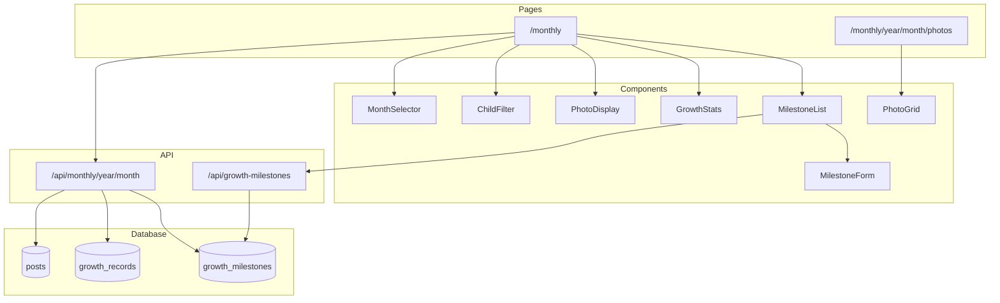
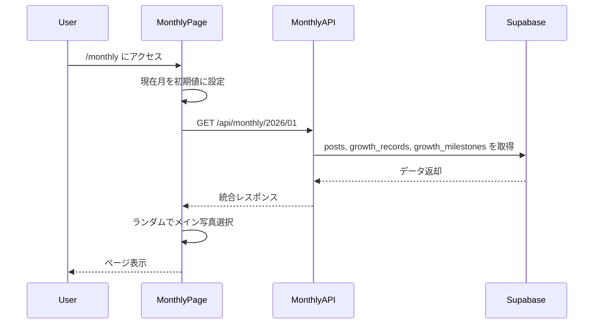
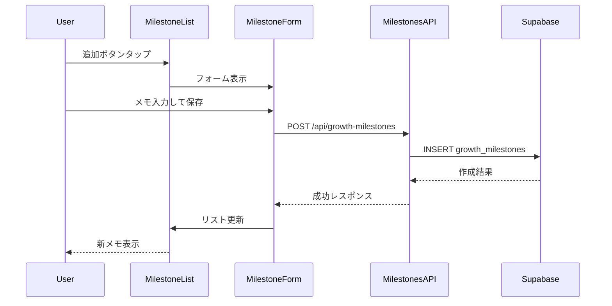

# Design Document: monthly-record

## Overview

**Purpose**: 月単位で子どもの成長を振り返るビューを提供し、写真・身体測定・発達マイルストーンを一覧表示する。

**Users**: 家族ユーザー（Admin/Editor）が、特定の月の子どもの様子を写真と記録から確認する。

**Impact**: 既存のタイムライン（時系列）、成長記録（グラフ）に加え、月単位の統合ビューを追加。ナビゲーションに新タブを追加。

### Goals
- 月単位で写真・成長記録・成長メモを一画面で確認できる
- 左右矢印で直感的に月を切り替えられる
- 成長メモ（マイルストーン）を簡単に記録・閲覧できる

### Non-Goals
- 月の記録の編集機能（写真キャプション編集など）は対象外
- 動画の月別再生機能は対象外
- 写真のスライドショー機能は対象外

## Architecture

### Existing Architecture Analysis

**現行システム**:
- Next.js 16 App Router でページルーティング
- BottomNav の navItems 配列でナビゲーション管理
- ChildFilter コンポーネントで子どもフィルタリング
- Supabase で認証・データ永続化
- Framer Motion でアニメーション

**維持する設計**:
- API パターン（認証チェック → クエリ → レスポンス）
- 型定義パターン（database.ts への追加）
- コンポーネント分離（components/monthly/ 配下）

### Architecture Pattern & Boundary Map



**Architecture Integration**:
- Selected pattern: Feature-based structure（monthly 機能を独立ディレクトリに）
- Domain/feature boundaries: 月の記録は独立機能、既存の timeline/growth とは分離
- Existing patterns preserved: API 認証パターン、型定義パターン、コンポーネント分離
- New components rationale: 月選択・写真表示・マイルストーン管理は monthly 固有
- Steering compliance: Supabase + Next.js + Framer Motion の技術スタック維持

### Technology Stack

| Layer | Choice / Version | Role in Feature | Notes |
|-------|------------------|-----------------|-------|
| Frontend | Next.js 16 + React 19 | ページ・コンポーネント | 既存維持 |
| UI Animation | Framer Motion | 月切り替えアニメーション | 既存 transitions 活用 |
| Backend | Next.js API Routes | 月別データ・成長メモ API | 新規エンドポイント追加 |
| Database | Supabase PostgreSQL | growth_milestones テーブル追加 | 新規テーブル |
| Styling | TailwindCSS | 既存デザインシステム | カラーパレット維持 |

## System Flows

### 月の記録ページ表示フロー



### 成長メモ追加フロー



## Requirements Traceability

| Requirement | Summary | Components | Interfaces | Flows |
|-------------|---------|------------|------------|-------|
| 1.1-1.4 | ナビゲーション拡張 | BottomNav | - | - |
| 2.1-2.6 | 月選択ナビゲーション | MonthSelector | - | 月の記録ページ表示 |
| 3.1-3.4 | 子どもフィルター | ChildFilter（再利用） | - | - |
| 4.1-4.6 | 写真表示 | PhotoDisplay | - | 月の記録ページ表示 |
| 5.1-5.5 | 月のギャラリー | PhotoGrid, GalleryPage | - | - |
| 6.1-6.4 | 成長記録表示 | GrowthStats | - | 月の記録ページ表示 |
| 7.1-7.6 | 成長メモ | MilestoneList, MilestoneForm | MilestonesAPI | 成長メモ追加 |
| 8.1-8.6 | 成長メモデータモデル | - | MilestonesAPI | - |
| 9.1-9.4 | 月別データ取得 API | - | MonthlyAPI | 月の記録ページ表示 |

## Components and Interfaces

| Component | Domain/Layer | Intent | Req Coverage | Key Dependencies | Contracts |
|-----------|--------------|--------|--------------|------------------|-----------|
| BottomNav | Layout | ナビゲーションに月の記録タブ追加 | 1.1-1.4 | - | - |
| MonthSelector | Monthly/UI | 月の選択・切り替え UI | 2.1-2.6 | - | State |
| PhotoDisplay | Monthly/UI | メイン写真とサムネイル表示 | 4.1-4.6 | next/image (P0) | - |
| GrowthStats | Monthly/UI | 身長・体重表示 | 6.1-6.4 | - | - |
| MilestoneList | Monthly/UI | 成長メモ一覧と追加 | 7.1-7.6 | MilestonesAPI (P0) | State |
| MilestoneForm | Monthly/UI | 成長メモ入力フォーム | 7.2-7.3 | - | - |
| PhotoGrid | Monthly/UI | ギャラリーグリッド表示 | 5.1-5.5 | next/image (P0) | - |
| MonthlyAPI | API | 月別データ統合取得 | 9.1-9.4 | Supabase (P0) | API |
| MilestonesAPI | API | 成長メモ CRUD | 8.4-8.6 | Supabase (P0) | API |

### Layout Layer

#### BottomNav（変更）

| Field | Detail |
|-------|--------|
| Intent | ナビゲーションに「月の記録」タブを追加 |
| Requirements | 1.1, 1.2, 1.3, 1.4 |

**Responsibilities & Constraints**
- navItems 配列に新項目を追加
- CalendarIcon を新規作成
- 既存のアニメーション・スタイルを維持

**Dependencies**
- Outbound: `/monthly` ページ — 遷移先 (P0)

**Implementation Notes**
- navItems 配列の「投稿」と「成長記録」の間に挿入
- アイコンは SVG で CalendarIcon を定義

### Monthly/UI Layer

#### MonthSelector

| Field | Detail |
|-------|--------|
| Intent | 左右矢印で月を切り替える UI |
| Requirements | 2.1, 2.2, 2.3, 2.4, 2.5, 2.6 |

**Responsibilities & Constraints**
- 現在選択中の月を「YYYY年M月」形式で表示
- 左右矢印ボタンで前後の月に遷移
- 境界チェック（最新月、最古月）

**Dependencies**
- Inbound: MonthlyPage — 月の状態と変更ハンドラ (P0)

**Contracts**: State [x]

##### State Management
```typescript
type MonthSelectorProps = {
  year: number;
  month: number;
  onPrevMonth: () => void;
  onNextMonth: () => void;
  hasPrevMonth: boolean;
  hasNextMonth: boolean;
};
```

**Implementation Notes**
- hasNextMonth は現在月と比較して判定
- hasPrevMonth は最古のデータ月と比較して判定
- Framer Motion で矢印タップ時のスケールアニメーション

#### PhotoDisplay

| Field | Detail |
|-------|--------|
| Intent | メイン写真（ランダム）とサムネイル群を表示 |
| Requirements | 4.1, 4.2, 4.3, 4.4, 4.5, 4.6 |

**Responsibilities & Constraints**
- 写真配列から1枚をランダムでメイン表示
- 残りを最大4枚までサムネイル表示
- 写真なし時は EmptyState 表示
- タップでギャラリーページに遷移

**Dependencies**
- Inbound: MonthlyPage — 写真配列 (P0)
- External: next/image — 画像最適化 (P0)

**Contracts**: State [x]

##### State Management
```typescript
type PhotoDisplayProps = {
  photos: Array<{
    id: string;
    media_url: string;
    created_at: string;
  }>;
  year: number;
  month: number;
  onPhotoTap: () => void;
};
```

**Implementation Notes**
- `useMemo` でランダムインデックスを計算（hydration 対応で `useEffect` + `useState` 使用）
- next/image の `sizes` prop で適切なサイズ指定

#### GrowthStats

| Field | Detail |
|-------|--------|
| Intent | 月の身長・体重を表示 |
| Requirements | 6.1, 6.2, 6.3, 6.4 |

**Responsibilities & Constraints**
- 身長・体重をアイコン付きで表示
- 記録なし時は「記録なし」と表示

**Dependencies**
- Inbound: MonthlyPage — 成長記録データ (P0)

**Contracts**: State [x]

##### State Management
```typescript
type GrowthStatsProps = {
  height: number | null;
  weight: number | null;
};
```

#### MilestoneList

| Field | Detail |
|-------|--------|
| Intent | 成長メモの一覧表示と追加・削除 |
| Requirements | 7.1, 7.2, 7.3, 7.4, 7.5, 7.6 |

**Responsibilities & Constraints**
- 成長メモを箇条書きで表示
- 追加ボタンで MilestoneForm を表示
- 長押しで削除オプション表示

**Dependencies**
- Inbound: MonthlyPage — 成長メモ配列、子ども ID、年月 (P0)
- Outbound: MilestonesAPI — CRUD 操作 (P0)

**Contracts**: State [x]

##### State Management
```typescript
type MilestoneListProps = {
  milestones: Array<{
    id: string;
    content: string;
  }>;
  childId: string;
  year: number;
  month: number;
  onAdd: (content: string) => Promise<void>;
  onDelete: (id: string) => Promise<void>;
};
```

**Implementation Notes**
- 長押し検出は `onTouchStart` + `setTimeout` で実装
- 削除確認はシンプルな confirm ダイアログ

#### MilestoneForm

| Field | Detail |
|-------|--------|
| Intent | 成長メモの入力フォーム |
| Requirements | 7.2, 7.3 |

**Responsibilities & Constraints**
- テキスト入力フィールドと保存ボタン
- 入力後に自動クローズ

**Dependencies**
- Inbound: MilestoneList — onSubmit ハンドラ (P0)

**Contracts**: State [x]

##### State Management
```typescript
type MilestoneFormProps = {
  isOpen: boolean;
  onClose: () => void;
  onSubmit: (content: string) => Promise<void>;
};
```

**Implementation Notes**
- Framer Motion の `slideInFromBottom` でスライドアップ表示
- 保存中は loading 状態でボタン非活性

#### PhotoGrid

| Field | Detail |
|-------|--------|
| Intent | ギャラリーページでの写真グリッド表示 |
| Requirements | 5.1, 5.3, 5.4, 5.5 |

**Responsibilities & Constraints**
- 全写真をグリッド形式で表示
- タップで拡大表示
- 投稿日時の新しい順でソート

**Dependencies**
- Inbound: GalleryPage — 写真配列 (P0)
- External: next/image — 画像最適化 (P0)

**Implementation Notes**
- 3列グリッドレイアウト
- 拡大表示はオーバーレイ + Framer Motion `scaleIn`

### API Layer

#### MonthlyAPI

| Field | Detail |
|-------|--------|
| Intent | 月別データ（写真・成長記録・成長メモ）の統合取得 |
| Requirements | 9.1, 9.2, 9.3, 9.4 |

**Responsibilities & Constraints**
- 指定月の posts, growth_records, growth_milestones を取得
- child_id でフィルタリング可能
- 認証必須

**Dependencies**
- External: Supabase — データ取得 (P0)

**Contracts**: API [x]

##### API Contract

| Method | Endpoint | Request | Response | Errors |
|--------|----------|---------|----------|--------|
| GET | /api/monthly/[year]/[month] | Query: child_id? | MonthlyDataResponse | 401, 500 |

```typescript
type MonthlyDataResponse = {
  photos: Array<{
    id: string;
    media_url: string;
    media_type: "image" | "video";
    created_at: string;
    child: {
      id: string;
      name: string;
    };
  }>;
  growthRecord: {
    height: number;
    weight: number;
    recorded_at: string;
  } | null;
  milestones: Array<{
    id: string;
    content: string;
    child_id: string;
  }>;
};
```

#### MilestonesAPI

| Field | Detail |
|-------|--------|
| Intent | 成長メモの CRUD 操作 |
| Requirements | 8.4, 8.5, 8.6 |

**Responsibilities & Constraints**
- 成長メモの取得・作成・削除
- child_id と month でフィルタリング
- 認証必須

**Dependencies**
- External: Supabase — データ操作 (P0)

**Contracts**: API [x]

##### API Contract

| Method | Endpoint | Request | Response | Errors |
|--------|----------|---------|----------|--------|
| GET | /api/growth-milestones | Query: child_id, month | { milestones } | 401, 500 |
| POST | /api/growth-milestones | Body: child_id, content, recorded_at | { milestone } | 400, 401, 500 |
| DELETE | /api/growth-milestones/[id] | - | { success } | 401, 404, 500 |

```typescript
type CreateMilestoneRequest = {
  child_id: string;
  content: string;
  recorded_at: string; // YYYY-MM-01 形式
};

type MilestoneResponse = {
  id: string;
  child_id: string;
  content: string;
  recorded_at: string;
  created_at: string;
};
```

## Data Models

### Domain Model

**Aggregates**:
- `GrowthMilestone`: 月単位の発達マイルストーン記録

**Business Rules**:
- 同じ child_id + recorded_at の組み合わせで複数のマイルストーンを登録可能
- recorded_at は月を表す（日付部分は常に 01）

### Physical Data Model

#### growth_milestones テーブル

| Column | Type | Constraints | Description |
|--------|------|-------------|-------------|
| id | uuid | PK, DEFAULT gen_random_uuid() | 主キー |
| child_id | uuid | FK → children(id), NOT NULL | 子ども ID |
| content | text | NOT NULL | メモ内容 |
| recorded_at | date | NOT NULL | 記録対象月（YYYY-MM-01） |
| created_at | timestamptz | DEFAULT now() | 作成日時 |

**Indexes**:
- `idx_growth_milestones_child_month`: (child_id, recorded_at) — 月別取得の高速化

**RLS Policy**:
- SELECT: 認証ユーザーのみ
- INSERT: 認証ユーザーのみ
- DELETE: 認証ユーザーのみ

### Data Contracts & Integration

**Type Definition Addition** (`src/types/database.ts`):

```typescript
growth_milestones: {
  Row: {
    id: string;
    child_id: string;
    content: string;
    recorded_at: string;
    created_at: string;
  };
  Insert: {
    id?: string;
    child_id: string;
    content: string;
    recorded_at: string;
    created_at?: string;
  };
  Update: {
    id?: string;
    child_id?: string;
    content?: string;
    recorded_at?: string;
    created_at?: string;
  };
  Relationships: [
    {
      foreignKeyName: "growth_milestones_child_id_fkey";
      columns: ["child_id"];
      isOneToOne: false;
      referencedRelation: "children";
      referencedColumns: ["id"];
    }
  ];
};
```

## Error Handling

### Error Categories and Responses

**User Errors (4xx)**:
- 401 Unauthorized: 認証が必要なページ/API へのアクセス → ログインページへリダイレクト
- 400 Bad Request: 成長メモの必須フィールド不足 → フィールドレベルのバリデーションメッセージ

**System Errors (5xx)**:
- 500 Internal Server Error: Supabase 接続エラー → 「データの取得に失敗しました」トースト表示

**Business Logic**:
- 写真なしの月: EmptyState コンポーネントで「写真がありません」表示
- 成長記録なしの月: 「記録なし」テキスト表示
- 成長メモなしの月: 「まだメモがありません」+ 追加ボタン表示

## Testing Strategy

### Unit Tests
- MonthSelector: 月の表示形式、境界条件でのボタン非活性
- GrowthStats: null 値の場合の「記録なし」表示
- 日付ユーティリティ: YYYY-MM-01 形式への変換

### Integration Tests
- MonthlyAPI: 月別データの統合取得、child_id フィルタリング
- MilestonesAPI: CRUD 操作、認証チェック

### E2E Tests
- 月の記録ページ表示 → 月切り替え → ギャラリー遷移
- 成長メモ追加 → 一覧表示 → 削除

## Performance & Scalability

**Target Metrics**:
- 月のデータ取得: 2秒以内（NFR より）
- 初期表示: LCP 2.5秒以内

**Optimization**:
- 写真は月の記録ページで最大10枚、ギャラリーでページング
- next/image で画像サイズ最適化
- API レスポンスに `Cache-Control` ヘッダー設定（60秒）
