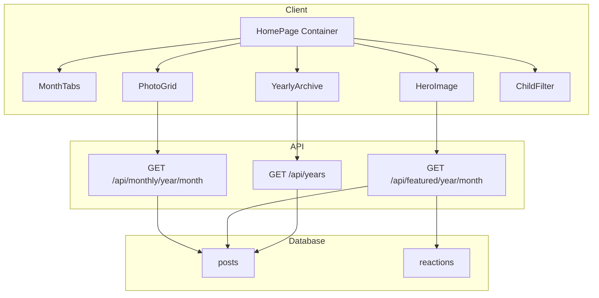
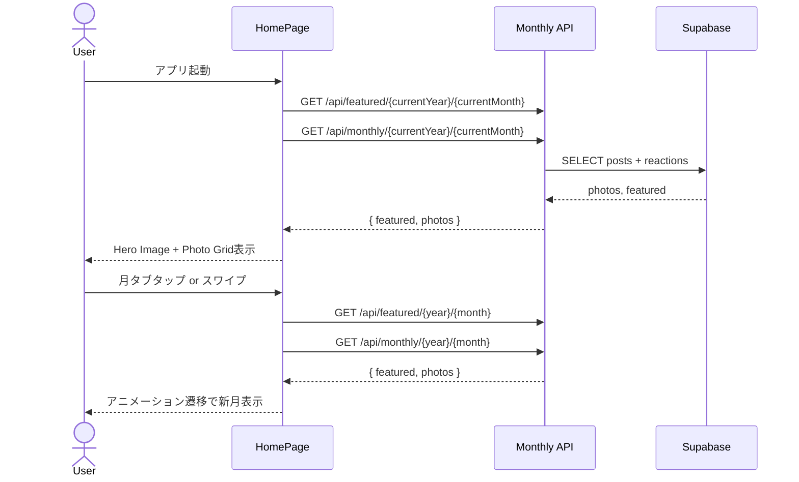
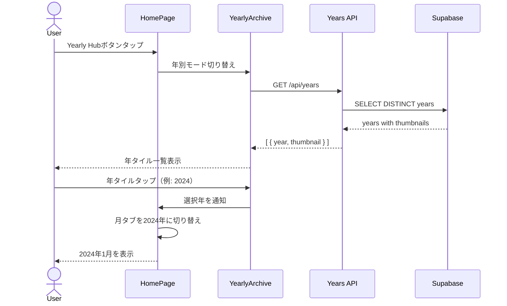
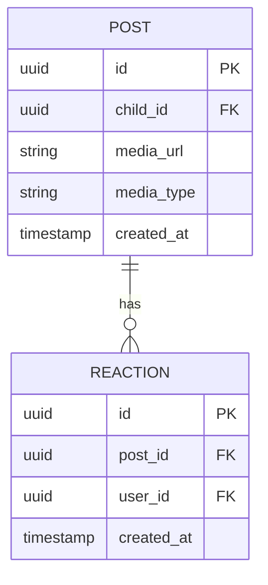

# Design Document

## Sprout 新ホーム画面 技術設計書 (v1.0.0)

## Overview

**Purpose**: 月ごとの思い出を美しく振り返り、過去データへのアクセスを最適化する新しいホーム画面を提供する。

**Users**: 家族写真を共有するユーザーが、当月の写真閲覧・過去アーカイブへのアクセス・月間ナビゲーションを直感的に行う。

**Impact**: 現在のタイムラインフィード形式を、月次ベースのギャラリー形式に完全置換する。

### Goals
- 当月の写真一覧と代表画像（Hero Image）をデフォルト表示
- タブ＋スワイプによる直感的な月間ナビゲーション
- 年別アーカイブで3タップ以内に目的の年月へ到達
- 既存コンポーネント（PhotoGrid, ChildFilter）の再利用

### Non-Goals
- カバー画像の手動設定機能（将来実装）
- 閲覧数トラッキング（将来実装）
- オフライン対応

## Architecture

### Existing Architecture Analysis

現在のホーム画面（`src/app/page.tsx`）:
- `TimelineFeed`コンポーネントでInstagram風タイムライン表示
- `ChildFilter`で子どもフィルタリング
- 無限スクロール＋Realtime購読

新設計では:
- タイムライン形式を月次ギャラリー形式に置換
- `ChildFilter`は継続利用
- 月タブ・年アーカイブ機能を新規追加

### Architecture Pattern & Boundary Map



**Architecture Integration**:
- Selected pattern: コンポーネント分離＋Container/Presentational
- Domain/feature boundaries: ホーム画面コンテナがすべての子コンポーネントを統括
- Existing patterns preserved: ChildFilter, PhotoGrid, AnimatedCard
- New components rationale: MonthTabs（月ナビ）, HeroImage（代表画像）, YearlyArchive（年別表示）

### Technology Stack

| Layer | Choice / Version | Role in Feature | Notes |
|-------|------------------|-----------------|-------|
| Frontend | Next.js 14 App Router | ページルーティング、SSR | 既存 |
| UI | Tailwind CSS 3.4 | スタイリング | 既存 |
| Animation | Framer Motion 12.23 | スワイプ、画面遷移アニメーション | 既存 |
| State | React useState + Context | 年月状態管理 | 新規Context追加 |
| Backend | Next.js Route Handlers | API提供 | 既存パターン踏襲 |
| Database | Supabase (PostgreSQL) | データ永続化 | 既存 |

## System Flows

### 月間ナビゲーションフロー



### 年別アーカイブフロー



## Requirements Traceability

| Requirement | Summary | Components | Interfaces | Flows |
|-------------|---------|------------|------------|-------|
| 2.1 | カレント表示・Featured Section | HomePage, HeroImage, PhotoGrid | FeaturedAPI, MonthlyAPI | 月間ナビゲーション |
| 2.2 | 月次ナビゲーション（タブ・スワイプ） | MonthTabs, HomePage | - | 月間ナビゲーション |
| 2.3 | アーカイブ・ドリルダウン | YearlyArchive, MonthTabs | YearsAPI | 年別アーカイブ |
| 3 | UI/UX仕様（Hero, Grid, Tabs） | HeroImage, PhotoGrid, MonthTabs | - | - |
| 4.1 | 代表画像選出アルゴリズム | - | FeaturedAPI | - |
| 4.2 | 3階層ディレクトリ構造 | YearlyArchive, MonthTabs, PhotoGrid | - | 年別アーカイブ |

## Components and Interfaces

| Component | Domain/Layer | Intent | Req Coverage | Key Dependencies | Contracts |
|-----------|--------------|--------|--------------|------------------|-----------|
| HomePage | Container | ホーム画面全体の状態管理と描画 | 2.1, 2.2, 2.3 | MonthTabs(P0), HeroImage(P0), PhotoGrid(P0) | State |
| MonthTabs | UI/Navigation | 月タブ表示とスワイプ操作 | 2.2 | HomePage(P0) | - |
| HeroImage | UI/Display | 代表画像の大型表示 | 2.1, 3 | FeaturedAPI(P0) | API |
| PhotoGrid | UI/Display | 写真グリッド表示 | 2.1, 3 | MonthlyAPI(P0) | API |
| YearlyArchive | UI/Navigation | 年別タイル表示とドリルダウン | 2.3, 4.2 | YearsAPI(P0) | API |
| ChildFilter | UI/Filter | 子どもフィルタリング | - | - | - |

### Container Layer

#### HomePage

| Field | Detail |
|-------|--------|
| Intent | ホーム画面全体の状態管理とレイアウト制御 |
| Requirements | 2.1, 2.2, 2.3 |

**Responsibilities & Constraints**
- 現在表示中の年月状態を管理
- 表示モード（通常/年別アーカイブ）を制御
- 子どもフィルター状態を管理

**Dependencies**
- Outbound: MonthTabs, HeroImage, PhotoGrid, YearlyArchive (P0)
- Outbound: ChildFilter (P1)

**Contracts**: State [x]

##### State Management

```typescript
interface HomePageState {
  currentYear: number;
  currentMonth: number; // 1-12
  selectedChildId: string | null;
  viewMode: 'monthly' | 'yearly';
}
```

- State model: React useState
- Persistence: セッション中のみ（永続化なし）
- Initial: サーバー時刻から当月を算出

**Implementation Notes**
- Integration: アプリ起動時にサーバーから当月取得
- Validation: 年月の範囲チェック（画像存在月のみ）

### UI/Navigation Layer

#### MonthTabs

| Field | Detail |
|-------|--------|
| Intent | 月タブの横スクロール表示とスワイプジェスチャー処理 |
| Requirements | 2.2 |

**Responsibilities & Constraints**
- 1月〜12月のタブを横並び表示
- 現在月のハイライト表示
- 左右スワイプで月移動

**Dependencies**
- Inbound: HomePage — 年月状態 (P0)
- External: Framer Motion — ドラッグジェスチャー (P0)

**Contracts**: -

```typescript
interface MonthTabsProps {
  year: number;
  currentMonth: number;
  availableMonths: number[]; // 画像が存在する月
  onMonthChange: (month: number) => void;
  onYearlyHubClick: () => void;
}
```

**Implementation Notes**
- スワイプしきい値: 横方向50px以上で月移動判定
- 年変更: 12月→1月で年+1、1月→12月で年-1

#### YearlyArchive

| Field | Detail |
|-------|--------|
| Intent | 年別タイル一覧とドリルダウン選択 |
| Requirements | 2.3, 4.2 |

**Responsibilities & Constraints**
- 画像が存在する年のタイルを表示
- 各年の代表サムネイルを表示
- 年タップで該当年の月タブへ遷移

**Dependencies**
- Inbound: HomePage — viewMode状態 (P0)
- External: YearsAPI — 年一覧取得 (P0)

**Contracts**: API [x]

##### API Contract

| Method | Endpoint | Request | Response | Errors |
|--------|----------|---------|----------|--------|
| GET | /api/years | ?childId | YearsResponse | 401, 500 |

```typescript
interface YearsResponse {
  years: {
    year: number;
    thumbnailUrl: string;
    photoCount: number;
  }[];
}
```

**Implementation Notes**
- 画像が0件の年は表示しない
- サムネイルは年内で最もLike数が多い画像

### UI/Display Layer

#### HeroImage

| Field | Detail |
|-------|--------|
| Intent | 月の代表画像を大型表示 |
| Requirements | 2.1, 3 |

**Responsibilities & Constraints**
- 画面上部1/3〜1/2領域に代表画像を表示
- アスペクト比を維持
- タップで詳細表示（将来）

**Dependencies**
- External: FeaturedAPI — 代表画像取得 (P0)

**Contracts**: API [x]

##### API Contract

| Method | Endpoint | Request | Response | Errors |
|--------|----------|---------|----------|--------|
| GET | /api/featured/{year}/{month} | ?childId | FeaturedResponse | 401, 404, 500 |

```typescript
interface FeaturedResponse {
  featured: {
    id: string;
    mediaUrl: string;
    childId: string;
    childName: string;
    createdAt: string;
    reactionCount: number;
  } | null;
}
```

**Implementation Notes**
- 代表画像なし時: プレースホルダー表示
- Next.js Imageで最適化配信

#### PhotoGrid

| Field | Detail |
|-------|--------|
| Intent | 月内の写真を3カラムグリッドで表示 |
| Requirements | 2.1, 3 |

**Responsibilities & Constraints**
- 3カラムのグリッドレイアウト
- 代表画像を除いた写真一覧
- タップで詳細モーダル（既存機能）

**Dependencies**
- External: MonthlyAPI — 月別写真取得 (P0)
- Inbound: HomePage — 年月・子どもID (P0)

**Contracts**: API [x]

##### API Contract

既存API `/api/monthly/{year}/{month}` を使用。

```typescript
interface MonthlyPhotosResponse {
  photos: {
    id: string;
    mediaUrl: string;
    createdAt: string;
  }[];
}
```

## Data Models

### Domain Model



**Business Rules**:
- 代表画像は月ごとに1つ（アルゴリズムで自動選出）
- 代表画像選出優先順位: Like数 > 最新投稿日

### Logical Data Model

**代表画像選出クエリ**:
```sql
SELECT p.*, COUNT(r.id) as reaction_count
FROM posts p
LEFT JOIN reactions r ON p.id = r.post_id
WHERE EXTRACT(YEAR FROM p.created_at) = :year
  AND EXTRACT(MONTH FROM p.created_at) = :month
  AND (:childId IS NULL OR p.child_id = :childId)
GROUP BY p.id
ORDER BY reaction_count DESC, p.created_at DESC
LIMIT 1
```

**年別一覧クエリ**:
```sql
SELECT
  EXTRACT(YEAR FROM created_at) as year,
  COUNT(*) as photo_count
FROM posts
WHERE (:childId IS NULL OR child_id = :childId)
GROUP BY year
ORDER BY year DESC
```

## Error Handling

### Error Strategy

| エラー種別 | 対応 |
|-----------|------|
| API 401 | ログイン画面へリダイレクト |
| API 404 (写真なし) | 「この月には写真がありません」メッセージ表示 |
| API 500 | リトライボタン付きエラー画面 |
| ネットワークエラー | オフラインバナー表示 |

### Monitoring

- エラーログはコンソール出力（既存パターン踏襲）
- 将来: Sentry等の導入検討

## Testing Strategy

### Unit Tests
- `selectFeaturedImage`: 代表画像選出ロジック
- `MonthTabs`: 月タブ状態管理
- `calculateAvailableMonths`: 利用可能月算出

### Integration Tests
- `/api/featured/{year}/{month}`: 代表画像API
- `/api/years`: 年別一覧API
- 月間ナビゲーション（タブクリック）

### E2E Tests
- ホーム画面初期表示（当月表示）
- 月タブによる月移動
- スワイプによる月移動
- 年別アーカイブからのドリルダウン

## Performance & Scalability

**Target Metrics**:
- 初期表示: 1秒以内（LCP）
- 月切り替え: 300ms以内

**Optimization**:
- Next.js Image による画像最適化
- APIレスポンスのキャッシュ（SWR/React Query検討）
- グリッド画像の遅延読み込み
