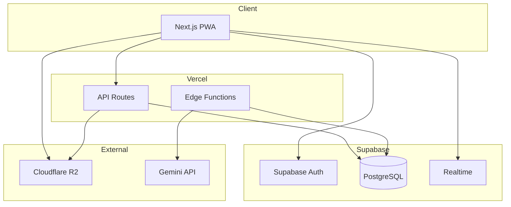
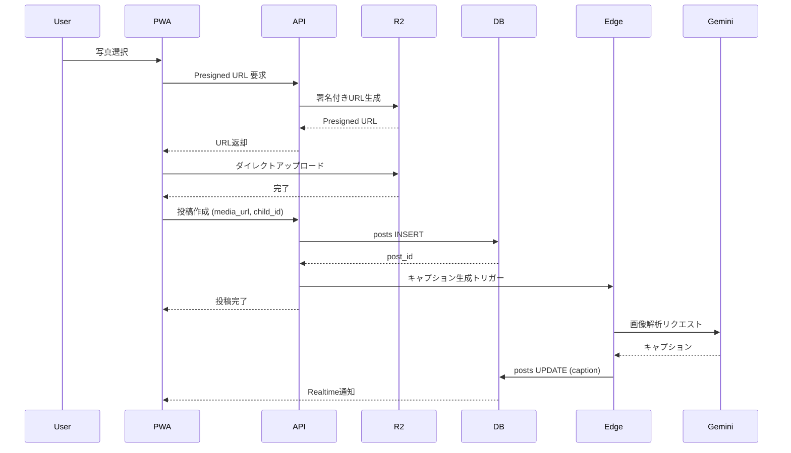
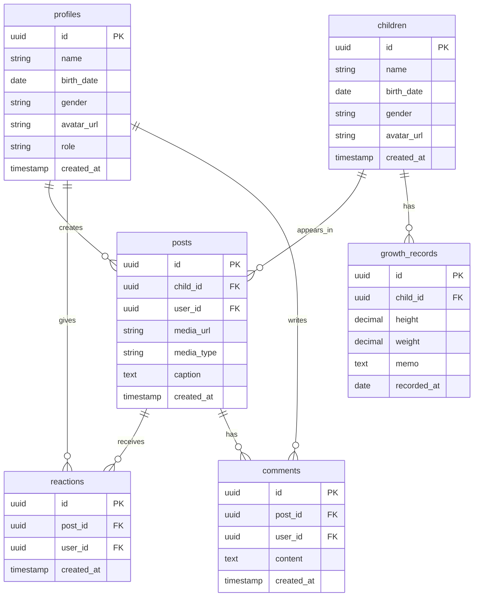

# Design Document: Sprout Family SNS

## Overview

**Purpose**: 家族専用クローズドSNS「Sprout」は、子供（カイリ・稀）の成長記録を写真・動画・身体測定データとともに一元管理し、AIによる自動キャプション生成で育児日記の負担を軽減する。

**Users**: 中野家の家族メンバー（Admin 1名、Editor 4名程度）が日常的に写真投稿、成長記録の閲覧、リアクションを行う。

**Impact**: LINEでの写真共有から専用プラットフォームへ移行し、10年後も見返せる永続的な成長記録アルバムを実現する。

### Goals
- 写真・動画のアップロードと時系列表示
- AI による育児日記キャプションの自動生成
- 身長・体重の成長記録グラフ化
- 家族間のリアクション・コメント機能
- PWA によるモバイルファーストUX

### Non-Goals
- 一般公開機能（完全クローズド）
- 複数家族対応（中野家専用）
- リアルタイムチャット機能
- 動画編集機能

---

## Architecture

### Architecture Pattern & Boundary Map



**Architecture Integration**:
- **Selected pattern**: Layered Architecture — シンプルで Next.js 標準パターンに適合
- **Domain boundaries**: UI層、API層、データ層の3層構成
- **New components rationale**: 家族限定のためシンプルな構成を維持

### Technology Stack

| Layer | Choice / Version | Role in Feature | Notes |
|-------|------------------|-----------------|-------|
| Frontend | Next.js 14 (App Router) + TypeScript | PWA、SSR/CSR ハイブリッド | Vercel デプロイ |
| Styling | Tailwind CSS 3.4 | レスポンシブUI、カスタムテーマ | M PLUS Rounded 1c フォント |
| Backend | Next.js API Routes + Supabase Edge Functions | REST API、非同期処理 | サーバーレス |
| Database | Supabase PostgreSQL | データ永続化、RLS | リアルタイム購読 |
| Storage | Cloudflare R2 | 画像・動画保存 | Presigned URL |
| AI | Gemini API (gemini-1.5-flash) | キャプション自動生成 | 無料枠活用 |
| Auth | Supabase Auth | Magic Link 認証 | 招待制 |

---

## System Flows

### 画像アップロード & AI キャプション生成フロー



**Key Decisions**:
- Presigned URL でサーバー負荷回避
- キャプション生成は非同期でUX優先
- Realtime で生成完了を即時反映

---

## Requirements Traceability

| Requirement | Summary | Components | Interfaces | Flows |
|-------------|---------|------------|------------|-------|
| 3.1 | タイムライン表示 | TimelineFeed, PostCard | PostService | - |
| 3.2 | アップロード & AI代筆 | UploadForm, CaptionGenerator | UploadService, CaptionService | 画像アップロードフロー |
| 3.3 | 身体測定ログ | GrowthForm, GrowthChart | GrowthService | - |
| 3.4 | リアクション機能 | ReactionButton, CommentSection | ReactionService | - |

---

## Components and Interfaces

| Component | Domain/Layer | Intent | Req Coverage | Key Dependencies | Contracts |
|-----------|--------------|--------|--------------|------------------|-----------|
| TimelineFeed | UI | 投稿一覧の無限スクロール表示 | 3.1 | PostService (P0) | State |
| PostCard | UI | 個別投稿の表示 | 3.1 | - | - |
| UploadForm | UI | 写真アップロードフォーム | 3.2 | UploadService (P0) | - |
| GrowthChart | UI | 成長グラフ描画 | 3.3 | GrowthService (P0) | - |
| PostService | Service | 投稿CRUD操作 | 3.1, 3.2 | Supabase (P0), R2 (P0) | Service, API |
| UploadService | Service | Presigned URL発行、アップロード管理 | 3.2 | R2 (P0) | Service, API |
| CaptionService | Service | AI キャプション生成 | 3.2 | Gemini API (P0) | Service |
| GrowthService | Service | 成長記録CRUD | 3.3 | Supabase (P0) | Service, API |
| ReactionService | Service | いいね・コメント操作 | 3.4 | Supabase (P0) | Service, API |

### Service Layer

#### PostService

| Field | Detail |
|-------|--------|
| Intent | 投稿の作成・取得・削除を管理 |
| Requirements | 3.1, 3.2 |

**Responsibilities & Constraints**
- 投稿データのCRUD操作
- 子供フィルタリング、ページネーション
- RLS による家族限定アクセス

**Dependencies**
- Outbound: Supabase — データ永続化 (P0)
- Outbound: R2 — メディアURL管理 (P0)
- Outbound: CaptionService — AI生成トリガー (P1)

**Contracts**: Service [x] / API [x]

##### Service Interface
```typescript
interface PostService {
  getPosts(params: GetPostsParams): Promise<Result<Post[], AppError>>;
  getPostById(id: string): Promise<Result<Post, AppError>>;
  createPost(input: CreatePostInput): Promise<Result<Post, AppError>>;
  updatePost(id: string, input: UpdatePostInput): Promise<Result<Post, AppError>>;
  deletePost(id: string): Promise<Result<void, AppError>>;
}

interface GetPostsParams {
  childId?: string;
  cursor?: string;
  limit: number;
}

interface CreatePostInput {
  childId: string;
  mediaUrl: string;
  mediaType: 'image' | 'video';
  caption?: string;
}

interface Post {
  id: string;
  childId: string;
  userId: string;
  mediaUrl: string;
  mediaType: 'image' | 'video';
  caption: string | null;
  createdAt: Date;
  child: Child;
  user: Profile;
  reactions: Reaction[];
  comments: Comment[];
}
```

##### API Contract
| Method | Endpoint | Request | Response | Errors |
|--------|----------|---------|----------|--------|
| GET | /api/posts | ?childId, cursor, limit | Post[] | 401, 500 |
| POST | /api/posts | CreatePostInput | Post | 400, 401, 500 |
| DELETE | /api/posts/[id] | - | void | 401, 404, 500 |

---

#### UploadService

| Field | Detail |
|-------|--------|
| Intent | R2 への Presigned URL 発行とアップロード管理 |
| Requirements | 3.2 |

**Responsibilities & Constraints**
- Presigned URL の生成（有効期限15分）
- ファイルパス規約の適用
- 許可ファイル形式の検証

**Dependencies**
- Outbound: Cloudflare R2 — ストレージ操作 (P0)

**Contracts**: Service [x] / API [x]

##### Service Interface
```typescript
interface UploadService {
  getPresignedUrl(params: PresignedUrlParams): Promise<Result<PresignedUrlResult, AppError>>;
}

interface PresignedUrlParams {
  childId: string;
  fileName: string;
  contentType: string;
}

interface PresignedUrlResult {
  uploadUrl: string;
  publicUrl: string;
  expiresAt: Date;
}
```

##### API Contract
| Method | Endpoint | Request | Response | Errors |
|--------|----------|---------|----------|--------|
| POST | /api/upload/presign | PresignedUrlParams | PresignedUrlResult | 400, 401, 500 |

---

#### CaptionService

| Field | Detail |
|-------|--------|
| Intent | Gemini API を使用した画像キャプション自動生成 |
| Requirements | 3.2 |

**Responsibilities & Constraints**
- 画像解析リクエストの送信
- プロンプトテンプレート管理
- 非同期処理（Edge Functions）

**Dependencies**
- Outbound: Gemini API — 画像解析 (P0)
- Outbound: Supabase — キャプション保存 (P0)

**Contracts**: Service [x]

##### Service Interface
```typescript
interface CaptionService {
  generateCaption(params: GenerateCaptionParams): Promise<Result<string, AppError>>;
}

interface GenerateCaptionParams {
  postId: string;
  imageUrl: string;
  childName: string;
  childAgeMonths: number;
}
```

**Implementation Notes**
- Edge Functions で非同期実行
- プロンプト例: 「この写真は{childName}（{age}）の様子です。温かみのある育児日記風のキャプションを1-2文で生成してください。」

---

#### GrowthService

| Field | Detail |
|-------|--------|
| Intent | 身長・体重の成長記録管理 |
| Requirements | 3.3 |

**Responsibilities & Constraints**
- 成長データのCRUD
- 月別集計、グラフ用データ整形

**Dependencies**
- Outbound: Supabase — データ永続化 (P0)

**Contracts**: Service [x] / API [x]

##### Service Interface
```typescript
interface GrowthService {
  getRecords(childId: string): Promise<Result<GrowthRecord[], AppError>>;
  createRecord(input: CreateGrowthInput): Promise<Result<GrowthRecord, AppError>>;
  updateRecord(id: string, input: UpdateGrowthInput): Promise<Result<GrowthRecord, AppError>>;
  deleteRecord(id: string): Promise<Result<void, AppError>>;
}

interface GrowthRecord {
  id: string;
  childId: string;
  height: number;
  weight: number;
  memo: string | null;
  recordedAt: Date;
}

interface CreateGrowthInput {
  childId: string;
  height: number;
  weight: number;
  memo?: string;
  recordedAt: Date;
}
```

##### API Contract
| Method | Endpoint | Request | Response | Errors |
|--------|----------|---------|----------|--------|
| GET | /api/growth/[childId] | - | GrowthRecord[] | 401, 404, 500 |
| POST | /api/growth | CreateGrowthInput | GrowthRecord | 400, 401, 500 |
| PUT | /api/growth/[id] | UpdateGrowthInput | GrowthRecord | 400, 401, 404, 500 |
| DELETE | /api/growth/[id] | - | void | 401, 404, 500 |

---

#### ReactionService

| Field | Detail |
|-------|--------|
| Intent | いいね・コメントの管理 |
| Requirements | 3.4 |

**Dependencies**
- Outbound: Supabase — データ永続化、Realtime (P0)

**Contracts**: Service [x] / API [x]

##### Service Interface
```typescript
interface ReactionService {
  toggleReaction(postId: string): Promise<Result<boolean, AppError>>;
  getComments(postId: string): Promise<Result<Comment[], AppError>>;
  createComment(postId: string, content: string): Promise<Result<Comment, AppError>>;
  deleteComment(commentId: string): Promise<Result<void, AppError>>;
}

interface Comment {
  id: string;
  postId: string;
  userId: string;
  content: string;
  createdAt: Date;
  user: Profile;
}
```

---

## Data Models

### Domain Model



### Physical Data Model (PostgreSQL)

```sql
-- profiles: Supabase Auth と連携
CREATE TABLE profiles (
  id UUID PRIMARY KEY REFERENCES auth.users(id) ON DELETE CASCADE,
  name TEXT NOT NULL,
  birth_date DATE,
  gender TEXT CHECK (gender IN ('male', 'female', 'other')),
  avatar_url TEXT,
  role TEXT NOT NULL DEFAULT 'editor' CHECK (role IN ('admin', 'editor')),
  created_at TIMESTAMPTZ DEFAULT NOW()
);

-- children: 子供情報
CREATE TABLE children (
  id UUID PRIMARY KEY DEFAULT gen_random_uuid(),
  name TEXT NOT NULL,
  birth_date DATE NOT NULL,
  gender TEXT CHECK (gender IN ('male', 'female')),
  avatar_url TEXT,
  created_at TIMESTAMPTZ DEFAULT NOW()
);

-- posts: 投稿
CREATE TABLE posts (
  id UUID PRIMARY KEY DEFAULT gen_random_uuid(),
  child_id UUID NOT NULL REFERENCES children(id) ON DELETE CASCADE,
  user_id UUID NOT NULL REFERENCES profiles(id) ON DELETE CASCADE,
  media_url TEXT NOT NULL,
  media_type TEXT NOT NULL CHECK (media_type IN ('image', 'video')),
  caption TEXT,
  created_at TIMESTAMPTZ DEFAULT NOW()
);

-- growth_records: 成長記録
CREATE TABLE growth_records (
  id UUID PRIMARY KEY DEFAULT gen_random_uuid(),
  child_id UUID NOT NULL REFERENCES children(id) ON DELETE CASCADE,
  height DECIMAL(5,2) NOT NULL,
  weight DECIMAL(5,2) NOT NULL,
  memo TEXT,
  recorded_at DATE NOT NULL,
  created_at TIMESTAMPTZ DEFAULT NOW()
);

-- reactions: いいね
CREATE TABLE reactions (
  id UUID PRIMARY KEY DEFAULT gen_random_uuid(),
  post_id UUID NOT NULL REFERENCES posts(id) ON DELETE CASCADE,
  user_id UUID NOT NULL REFERENCES profiles(id) ON DELETE CASCADE,
  created_at TIMESTAMPTZ DEFAULT NOW(),
  UNIQUE(post_id, user_id)
);

-- comments: コメント
CREATE TABLE comments (
  id UUID PRIMARY KEY DEFAULT gen_random_uuid(),
  post_id UUID NOT NULL REFERENCES posts(id) ON DELETE CASCADE,
  user_id UUID NOT NULL REFERENCES profiles(id) ON DELETE CASCADE,
  content TEXT NOT NULL,
  created_at TIMESTAMPTZ DEFAULT NOW()
);

-- Indexes
CREATE INDEX idx_posts_child_id ON posts(child_id);
CREATE INDEX idx_posts_created_at ON posts(created_at DESC);
CREATE INDEX idx_growth_records_child_id ON growth_records(child_id);
CREATE INDEX idx_comments_post_id ON comments(post_id);
```

### Row Level Security (RLS) Policies

```sql
-- 全テーブルで RLS 有効化
ALTER TABLE profiles ENABLE ROW LEVEL SECURITY;
ALTER TABLE children ENABLE ROW LEVEL SECURITY;
ALTER TABLE posts ENABLE ROW LEVEL SECURITY;
ALTER TABLE growth_records ENABLE ROW LEVEL SECURITY;
ALTER TABLE reactions ENABLE ROW LEVEL SECURITY;
ALTER TABLE comments ENABLE ROW LEVEL SECURITY;

-- profiles: 認証済みユーザーのみ閲覧可能
CREATE POLICY "Authenticated users can view profiles"
  ON profiles FOR SELECT
  USING (auth.role() = 'authenticated');

-- posts: 認証済みユーザーのみ全操作可能
CREATE POLICY "Authenticated users can view posts"
  ON posts FOR SELECT
  USING (auth.role() = 'authenticated');

CREATE POLICY "Authenticated users can create posts"
  ON posts FOR INSERT
  WITH CHECK (auth.uid() = user_id);

CREATE POLICY "Users can update own posts"
  ON posts FOR UPDATE
  USING (auth.uid() = user_id);

CREATE POLICY "Users can delete own posts"
  ON posts FOR DELETE
  USING (auth.uid() = user_id);
```

---

## Error Handling

### Error Categories and Responses

| Category | HTTP Status | Handling |
|----------|-------------|----------|
| 認証エラー | 401 | ログイン画面へリダイレクト |
| 権限エラー | 403 | エラーメッセージ表示 |
| バリデーションエラー | 400 | フィールド別エラー表示 |
| Not Found | 404 | 404ページ表示 |
| サーバーエラー | 500 | 汎用エラー画面、リトライ促進 |

### Error Type Definition

```typescript
type AppError =
  | { type: 'UNAUTHORIZED'; message: string }
  | { type: 'FORBIDDEN'; message: string }
  | { type: 'NOT_FOUND'; resource: string }
  | { type: 'VALIDATION'; fields: Record<string, string> }
  | { type: 'UPLOAD_FAILED'; reason: string }
  | { type: 'AI_GENERATION_FAILED'; reason: string }
  | { type: 'INTERNAL'; message: string };
```

---

## Testing Strategy

### Unit Tests
- `PostService.createPost` — 投稿作成ロジック
- `UploadService.getPresignedUrl` — URL生成パラメータ検証
- `CaptionService.generateCaption` — プロンプト構築
- 月齢計算ユーティリティ

### Integration Tests
- Supabase RLS ポリシーの動作確認
- R2 アップロードフロー
- Gemini API レスポンス処理

### E2E Tests
- 写真アップロード → タイムライン表示
- 成長記録入力 → グラフ反映
- いいね・コメント操作

---

## Security Considerations

- **認証**: Supabase Magic Link（招待制）
- **認可**: RLS で全テーブル保護
- **ストレージ**: Presigned URL（有効期限15分）
- **API保護**: 認証必須、レート制限

---

## Performance & Scalability

- **画像最適化**: Next.js Image コンポーネント + R2 配信
- **キャッシュ**: SWR によるクライアントキャッシュ
- **ページネーション**: カーソルベース無限スクロール
- **PWA**: Service Worker による画像キャッシュ
